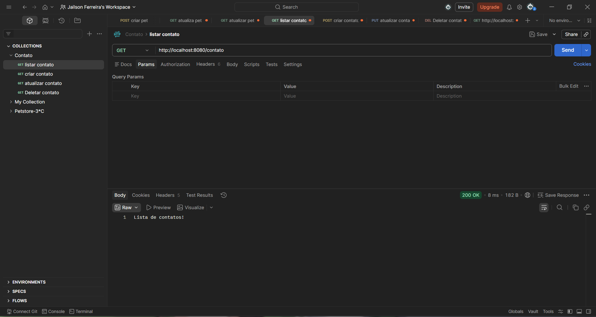
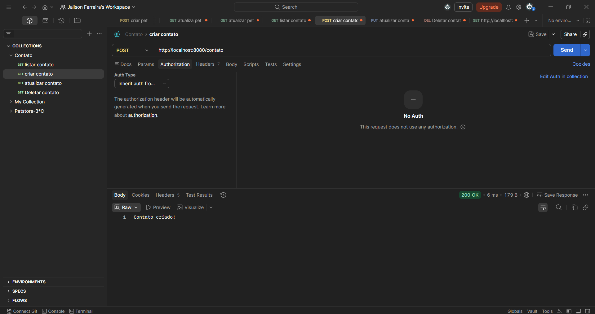
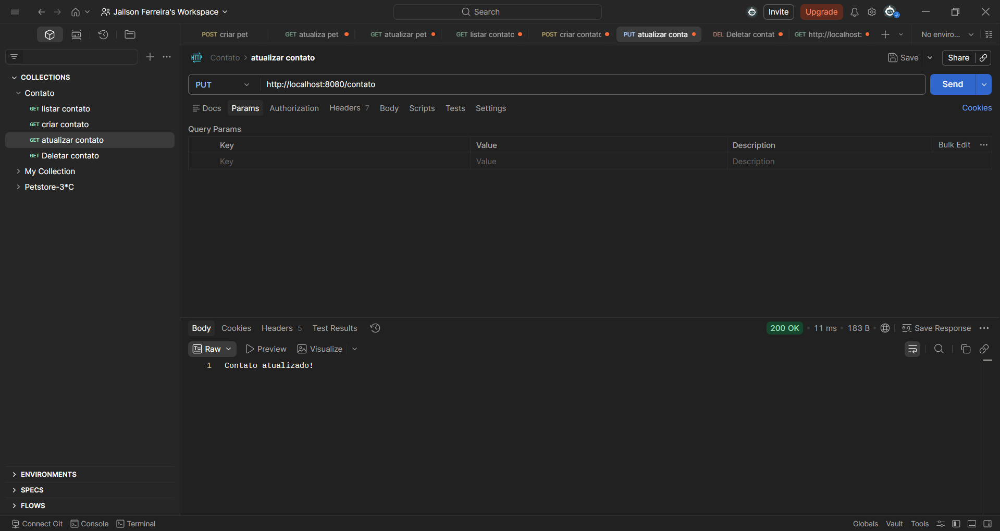
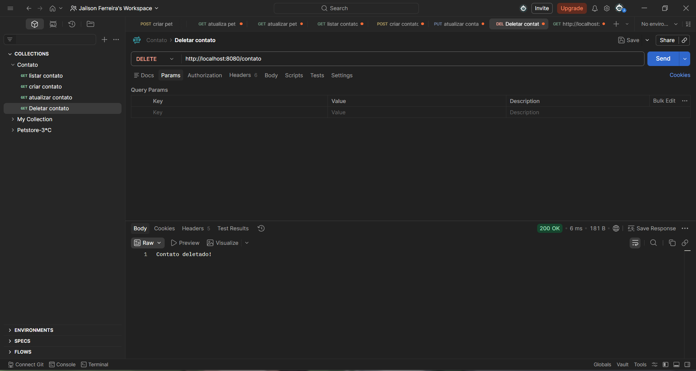

# 👾 API Contato - Spring Boot

Projeto desenvolvido para a disciplina de Back-End.

## 🚀 Endpoints

- GET /contato → Lista de contatos  
- POST /contato → Cria contato  
- PUT /contato → Atualiza contato  
- DELETE /contato → Deleta contato  

## 🧪 Testes no Postman

### GET

### POST

### PUT

### DELETE

